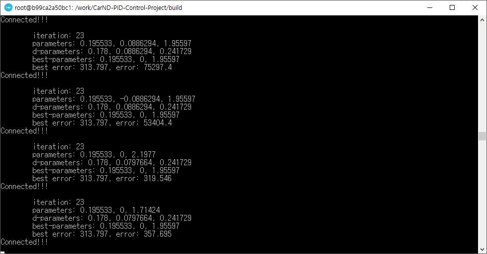

# CarND-Controls-PID
Self-Driving Car Engineer Nanodegree Program

---

## Dependencies

* cmake >= 3.5
 * All OSes: [click here for installation instructions](https://cmake.org/install/)
* make >= 4.1(mac, linux), 3.81(Windows)
  * Linux: make is installed by default on most Linux distros
  * Mac: [install Xcode command line tools to get make](https://developer.apple.com/xcode/features/)
  * Windows: [Click here for installation instructions](http://gnuwin32.sourceforge.net/packages/make.htm)
* gcc/g++ >= 5.4
  * Linux: gcc / g++ is installed by default on most Linux distros
  * Mac: same deal as make - [install Xcode command line tools]((https://developer.apple.com/xcode/features/)
  * Windows: recommend using [MinGW](http://www.mingw.org/)
* [uWebSockets](https://github.com/uWebSockets/uWebSockets)
  * Run either `./install-mac.sh` or `./install-ubuntu.sh`.
  * If you install from source, checkout to commit `e94b6e1`, i.e.
    ```
    git clone https://github.com/uWebSockets/uWebSockets 
    cd uWebSockets
    git checkout e94b6e1
    ```
    Some function signatures have changed in v0.14.x. See [this PR](https://github.com/udacity/CarND-MPC-Project/pull/3) for more details.
* Simulator. You can download these from the [project intro page](https://github.com/udacity/self-driving-car-sim/releases) in the classroom.

There's an experimental patch for windows in this [PR](https://github.com/udacity/CarND-PID-Control-Project/pull/3)

## Basic Build Instructions

1. Clone this repo.
2. Make a build directory: `mkdir build && cd build`
3. Compile: `cmake .. && make`
4. Run it: `./pid`. 

Tips for setting up your environment can be found [here](https://classroom.udacity.com/nanodegrees/nd013/parts/40f38239-66b6-46ec-ae68-03afd8a601c8/modules/0949fca6-b379-42af-a919-ee50aa304e6a/lessons/f758c44c-5e40-4e01-93b5-1a82aa4e044f/concepts/23d376c7-0195-4276-bdf0-e02f1f3c665d)

## Reflection

The video recording the implementation results can be viewed in [Video](https://youtu.be/fVyjub0ElTw).

#### Effects of P, I, D components

PID control is the most commonly used control method among the automatic control methods. Here, PID means to determine the control component by P, Proportinal, I: Integral and D: Differential.

* P component : P component is a component that linearly reduces the error value. This is the most intuitive control method when designing a controller.

* I component : I component is a component that reduces the integral error along the time axis. This is a control method that can effectively compensate for hardware bias errors.

* D component : D component is the component that reduces the difference value of error. This component prevents unstable control behavior such as oscillation. Especially when you need to change the control smoothly, such as the curve path, this component should be tuned high.


#### How to tune P, I, D, parameters

I implemented a twiddle algorithm to tune parameters. 

I implemented the Twiddle class in [twiddle.cpp](https://github.com/penny4860/CarND-PID-Control-Project/blob/master/src/twiddle.cpp)
I created a Twiddle object in the main function to monitor the parameter update process. The figure below shows the update process of P, I, D parameter by twiddle algorithm.



In this case, since it is time consuming to obtain the error for the whole track, the total error at the 2000th time step is used as the error of the twiddle algorithm. The parameters finally determined through this process are as follows.

* Kp : 0.195533
* Ki : 0.0
* Kd : 1.95597

Before I set the parameters using the twiddle algorithm, I thought I had to increase the tuning coefficient of the P component. This is because the P component is a component that directly reduces cross-track error. However, using the twiddle algorithm, the tuning coefficient of the D component was determined to be much larger. Perhaps the influence of the D component seems to be great in order to smooth the control in the curve path. The tuning coefficient of the I component is 0.0. In the udacity simulator, there seems to be little or no hardware error.


